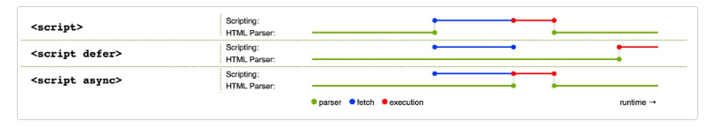

## Namaste React Course by Akshay Saini
# _Chapter 01 - Inception_

1. What is Emmet?
Ans: Emmet is a set of plug-ins for text editors that helps web developers write HTML and CSS code faster and more efficiently:

2. Difference between a Library and Framework?
Ans: 
"React is a library that helps build user interfaces, letting you control how to use it, while frameworks like Next.js provide a full structure for building web applications."

3 What is CDN? Why do we use it?
Ans: A CDN (Content Delivery Network) is a system of distributed servers that deliver web content to users based on their geographic location.
Use CDN: For simplicity and speed in small projects.
Use npm: For control, consistency, and advanced features in larger projects.

4. Why is React known as React?
Ans: React to Changes: React is named for its ability to automatically update the user interface when data changes.

5. What is crossorigin in script tag?
Ans: The crossorigin attribute in a 
  
  
  
</head>
In this example:

critical-library.js loads immediately (maybe it's crucial for page functionality)
google-analytics.js loads asynchronously (it doesn't affect page content)
menu.js and carousel.js are deferred (they need the DOM, and order matters)

Async: order not maintained
Defer: order maintained

